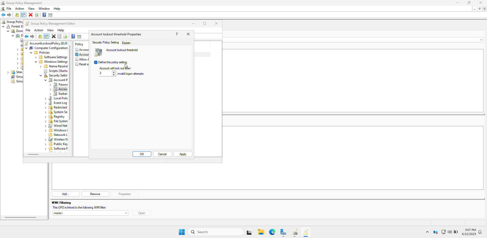
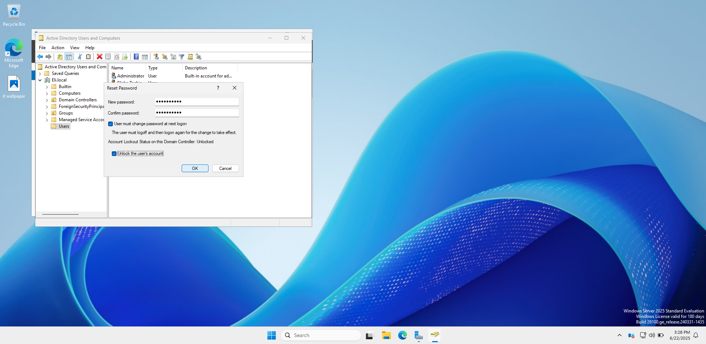
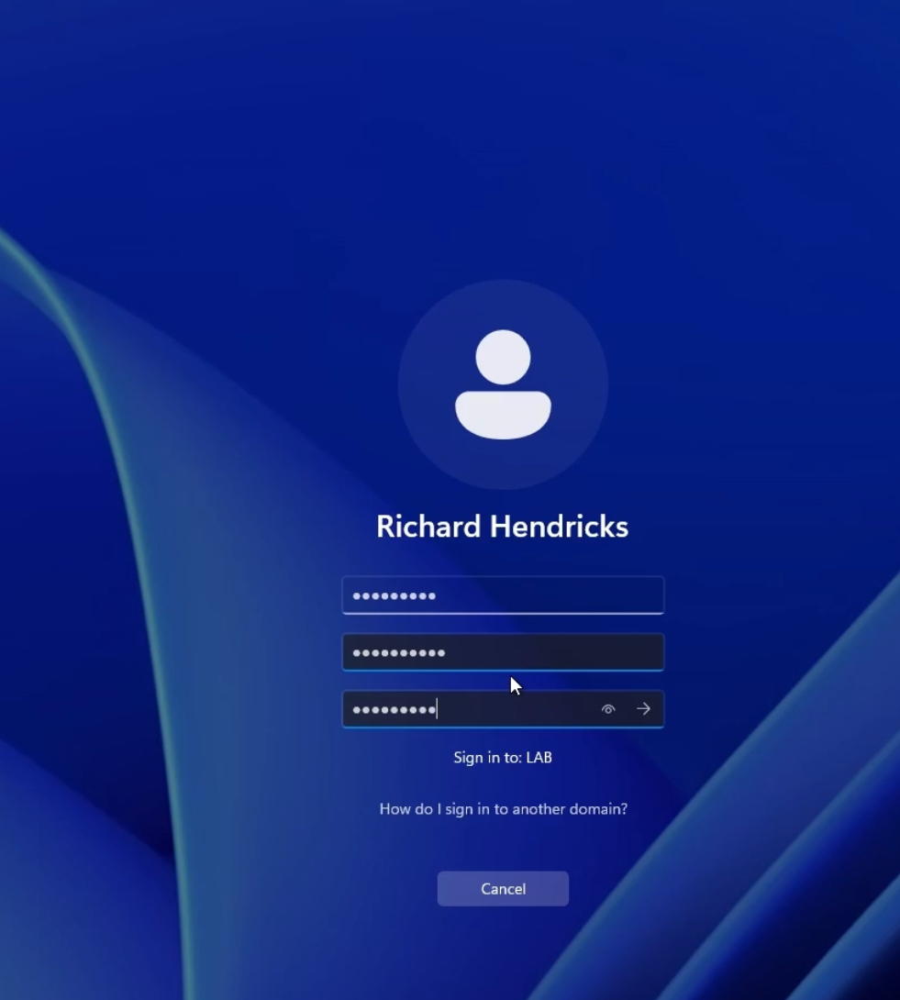
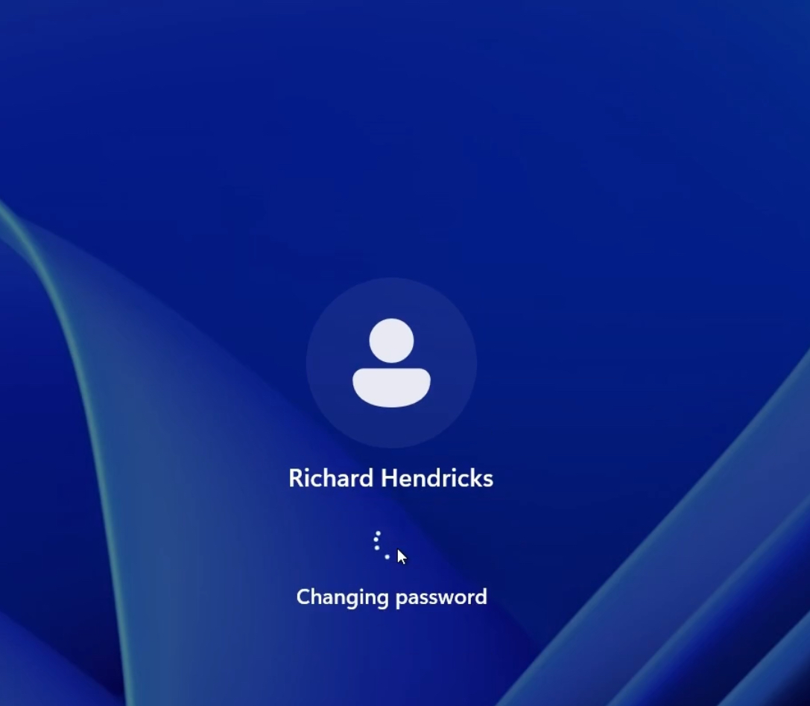

# Active Directory Password Reset Process  
*Demonstrating account unlock and forced password reset procedures*

---

## Step 1: Account Locked Out  
  
- User "Richard Hendricks" locked out after multiple failed login attempts  
- Common causes: Forgotten password or intrusion attempts  

---

## Step 2: Administrator Password Reset  
### Locate User in ADUC  
  
- Open **Active Directory Users and Computers**  
- Find user → Right-click → **Reset Password**  

### Configure Password Settings  
  
- Enter temporary password  
- Check: **User must change password at next logon**  
- Check: **Unlock account** (if locked)  

---

## Step 3: User Login Experience  
### Initial Login Prompt  
  
- User must select correct domain (`LAB` in this case)  

### Password Change Requirement  
  
- System requires password change before granting access  

### Password Update Screen  
  
- User enters temporary password + new secure password  
